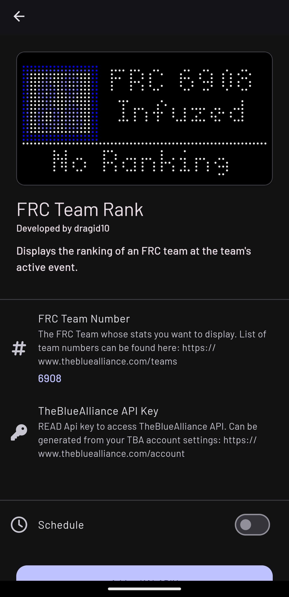
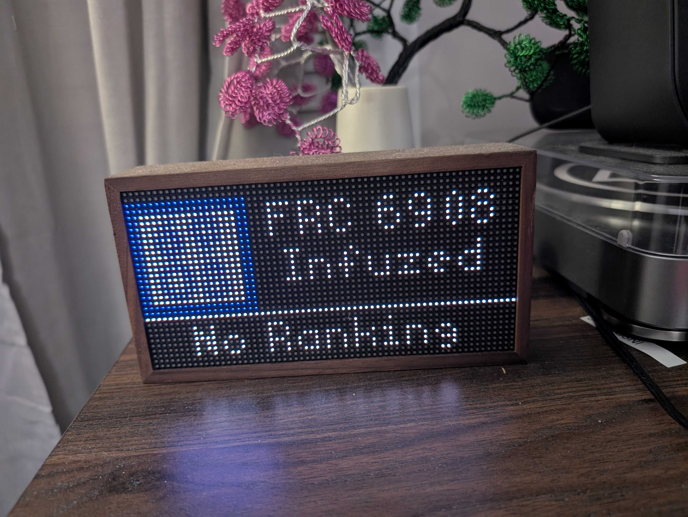

With the First Robotics Competition season here, I took some time during a Saturday shop session to create a new Tidbyt app that I'm pretty darn proud of!

Using Starlark, I developed an app now available on the Tidbyt community repo. This app provides the current ranking of a specific team at the ongoing competition. It'll display the team's official Avatar, the team number, the team name and whatever the team's district event ranking is.

Ways it could probably be improved:

- Get the ranking from an arbitrary district event, instead of just the current district event
- Make the team name marquee a little more smooth (sometimes if the team name is long, it doesn't scroll nicely)
- Add the team's district points to the display
- Show the team's next qualification match number

For Tidbyt owners, the FRC Team Rank app is ready for download! Feel free to contribute by submitting a pull request if you encounter any bugs.
[Tidbyt Community Repo](https://github.com/tidbyt/community/tree/main/apps/frcteamrank)

---

